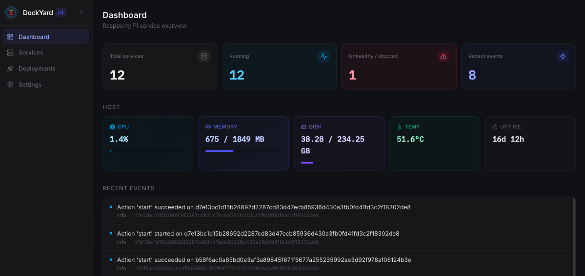
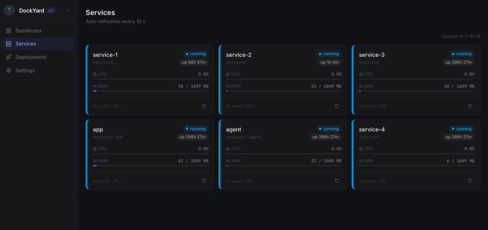
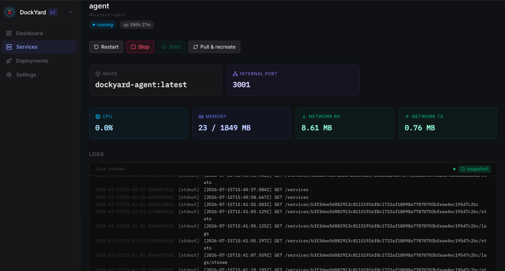

<div align="center">
  

  <h1>DockYard</h1>

  <p>
    A focused, private Docker control panel for Raspberry Pi.<br />
    Monitor services, inspect live logs, and run lifecycle actions from one place.
  </p>

  <p>
    <a href="#quick-start"><strong>Quick start</strong></a>
    ·
    <a href="#screenshots"><strong>Screenshots</strong></a>
    ·
    <a href="#architecture"><strong>Architecture</strong></a>
    ·
    <a href="#roadmap"><strong>Roadmap</strong></a>
  </p>

  <p>
    
    
    
    
    <a href="LICENSE"></a>
  </p>
</div>

> [!IMPORTANT]
> DockYard can control Docker containers. Keep it on a trusted private network and place it behind Tailscale, Cloudflare Access, or another authenticated gateway. It is not designed to be exposed directly to the public internet.

## About

DockYard sits above an existing Docker setup and provides the controls that matter for a small self-hosted server—without the surface area of a general-purpose container platform. It is also a hands-on Next.js project for exploring Server Components, Server Actions, SSR, streaming, and self-hosted deployment.

### Highlights

- **At-a-glance health** — container state, host CPU, memory, disk, temperature, and uptime
- **Service overview** — live CPU and RAM usage with automatic refresh
- **Deep inspection** — image, ports, network traffic, uptime, and real-time logs
- **Lifecycle controls** — start, stop, restart, pull, and recreate containers
- **Audit trail** — deployment history and recent infrastructure events
- **Constrained access** — the web app talks to a small local agent instead of mounting the Docker socket

## Screenshots

### Dashboard

Host health, service status, and recent events in a single view.

<p align="center">
  
</p>

<table>
  <tr>
    <td width="50%">
      <strong>Services</strong><br /><br />
      
    </td>
    <td width="50%">
      <strong>Service detail</strong><br /><br />
      
    </td>
  </tr>
  <tr>
    <td>Scan container status and resource usage at a glance.</td>
    <td>Inspect metrics, stream logs, and run lifecycle actions.</td>
  </tr>
</table>

## Architecture

```text
Browser
  └── Next.js app
        ├── Server Components  Initial service data and dashboard shell
        ├── Client Components  Live metrics, logs, and interactive controls
        ├── Server Actions     Authenticated container mutations
        └── Route Handlers     Browser-safe polling and SSE endpoints
              │
              │ Bearer token over a private Docker network
              ▼
        Node.js / Express agent
              └── dockerode ──► /var/run/docker.sock
```

The Next.js app never accesses the Docker socket directly. Infrastructure reads and mutations pass through the agent, which exposes only the operations used by the dashboard and records each action.

| Layer            | Technology                           | Responsibility                                            |
| ---------------- | ------------------------------------ | --------------------------------------------------------- |
| Web app          | Next.js 16, React 19, Tailwind CSS 4 | UI, routing, SSR, authentication, and Server Actions      |
| Live data        | SWR and Server-Sent Events           | Service polling, host metrics, and log streaming          |
| Pi agent         | Node.js and Express 5                | Constrained infrastructure API and audit events           |
| Docker           | dockerode                            | Container metadata, stats, logs, and lifecycle operations |
| Shared contracts | TypeScript workspace package         | Types shared by the app and agent                         |

## Quick start

### Requirements

- A 64-bit Raspberry Pi OS or another Linux host
- Docker Engine with the Docker Compose plugin
- OpenSSL for local secret generation

Clone the repository, then run the setup helper from its root:

```bash
git clone https://github.com/dev-reedus/dockyard-pi.git
cd dockyard-pi
./run.sh
```

On its first run, the script creates the two local environment files and generates `AUTH_SECRET` and a shared `AGENT_TOKEN`. Before the stack can start, set a strong dashboard password:

```dotenv
# .env
AUTH_PASSWORD=replace-with-a-strong-password
```

Run `./run.sh` again, then open `http://<pi-ip>:3000`.

> [!NOTE]
> `AUTH_COOKIE_SECURE=false` supports direct HTTP access on a trusted LAN. Set it to `true` when DockYard is served over HTTPS.

## Local development

Install the root workspace dependencies and create the environment files:

```bash
npm install
cp .env.example .env
cp agent/.env.example agent/.env
```

Set the same `AGENT_TOKEN` in both files, then run the app and agent in separate terminals:

```bash
# Terminal 1 — Next.js app
npm run dev

# Terminal 2 — Pi agent
npm run dev --workspace agent
```

The dashboard is available at [http://localhost:3000](http://localhost:3000), and the agent health endpoint is available at [http://localhost:3001/health](http://localhost:3001/health).

Useful checks from the repository root:

```bash
npm run lint
npm run type-check
npm run format:check
npm run build
```

## Deploying to a 32-bit Pi

Next.js 16 relies on native SWC and Turbopack binaries that are unavailable on ARMv7, so build the application image on another machine and deploy the result:

```bash
./deploy.sh                         # pi@raspberrypi.local
./deploy.sh pi@192.168.1.42         # custom SSH target
```

The target Pi must have Docker installed and this repository cloned at `~/dockyard-pi`. The script builds the ARMv7 image with Buildx, copies it to the Pi, loads it, and restarts the Compose stack. A 64-bit Pi can also use this flow to offload the build.

## Project structure

```text
.
├── src/
│   ├── app/
│   │   ├── (dashboard)/       # Protected dashboard routes
│   │   ├── api/               # Polling and SSE route handlers
│   │   └── login/             # Password login
│   ├── components/            # Server and client UI components
│   ├── hooks/                 # Live service data hooks
│   └── lib/                   # Auth, agent adapter, and Server Actions
├── agent/
│   └── src/
│       ├── routes/            # Services, stats, logs, actions, and events
│       ├── middleware/        # Bearer-token authentication
│       └── lib/               # Docker and host adapters, audit store
├── packages/types/            # Contracts shared across both runtimes
├── docs/screenshots/          # README imagery
└── compose.yml                # App and agent production stack
```

For the agent API and its local setup, see [agent/README.md](agent/README.md).

## Security model

- The application and agent communicate on an internal Compose network.
- Agent endpoints require a shared bearer token; only `/health` is unauthenticated.
- Browser sessions use signed, HTTP-only, `SameSite=Strict` cookies.
- Dashboard actions are executed server-side and written to an audit trail.
- The agent exposes a small allowlisted API instead of the raw Docker API.

This narrows access, but control of the Docker daemon is still highly privileged. Use unique secrets, restrict network access, and enable HTTPS cookies when a TLS proxy is present.

## Roadmap

### v1

- [x] Shared app/agent TypeScript contracts
- [x] Live log streaming with SSE
- [x] Raspberry Pi host metrics
- [ ] Configurable polling, authentication, and danger-zone settings
- [ ] Deployment history polish
- [ ] Structured agent request logging
- [ ] Per-service action allowlists

### Later

- [ ] Compose diff preview before redeploying
- [ ] GitHub webhook deployments
- [ ] Cloudflare and Tailscale route visualization
- [ ] Multiple Raspberry Pi hosts
- [ ] Historical resource charts
- [ ] Dark and light themes

## License

DockYard is available under the [MIT License](LICENSE).
