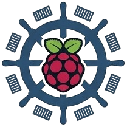

<p align="center">
  
</p>

<h1 align="center">DockYard</h1>
<p align="center">A private control panel for your Raspberry Pi — built to experiment Next.js App Router, Server Actions, and SSR patterns, even if is not the best choice for this kind of project.</p>

---

## What it is

DockYard sits above your existing Docker setup and gives you a focused, opinionated dashboard built around your
workflow — not every Docker use case on earth.

- **Services overview** — status, health, CPU, memory, public URL, uptime
- **Service detail** — ports, volumes, logs, resource stats, healthchecks
- **Actions** — start, stop, restart, pull & recreate via Server Actions
- **Deployment history** — full audit trail of every mutation
- **Events panel** — container events, alerts, system messages

## Architecture

```
Browser
  └── Next.js (App Router)
        ├── Server Components  →  Server side render
        ├── Client Components  →  SWR polling, charts, action buttons
        └── Server Actions     →  mutations (restart, stop, recreate…)
              └── Pi Agent (Express)
                    └── Docker socket  (/var/run/docker.sock)
```

The Next.js app never touches the Docker socket directly. All Docker operations go through a small Express agent running
on the Pi that exposes only the operations the dashboard needs.

## Stack

| Layer              | Tech                                     |
| ------------------ | ---------------------------------------- |
| Frontend + runtime | Next.js 15, React 19, Tailwind CSS       |
| Data fetching      | Server Components + SWR for live polling |
| Mutations          | Server Actions (`'use server'`)          |
| Pi agent           | Node.js + Express 5                      |
| Docker access      | `dockerode` via the agent                |
| Auth               | Cookie session + bcrypt password         |

## Project structure

```
/
├── src/
│   ├── app/
│   │   ├── (dashboard)/        # Protected route group
│   │   │   ├── dashboard/      # Health summary + events
│   │   │   ├── services/       # Service list + [id] detail
│   │   │   ├── deployments/    # Action history
│   │   │   └── settings/       # App config
│   │   ├── api/services/       # Route handlers for SWR polling
│   │   └── login/              # Auth page
│   ├── components/             # UI components
│   ├── hooks/                  # useServices, useServiceStats
│   ├── lib/                    # fetch adapters
│   └── types/                  # Shared TypeScript types
└── agent/
    └── src/
        ├── routes/             # services, stats, logs, actions, deployments
        ├── middleware/auth.ts  # Token-based auth
        └── lib/docker.ts       # dockerode wrapper
```

## Setup

### Deploy on the Pi (Docker Compose — 64-bit only)

> **32-bit Pi:** use the [build and deploy from another machine](#build-and-deploy-from-another-machine) section
> instead.

Clone the repo on the Pi and run:

```bash
bash run.sh
```

The script will:

1. Copy `.env.example` → `.env` and `agent/.env.example` → `agent/.env` if they don't exist
2. Auto-generate `AUTH_SECRET` and `AGENT_TOKEN` (shared between both services)
3. Refuse to start until `AUTH_PASSWORD` is changed from the placeholder
4. Build both Docker images and start the stack

DockYard will be available at `http://<pi-ip>:3000`.

> **Change `AUTH_PASSWORD`** in `.env` before putting this on a network.

The default `AUTH_COOKIE_SECURE=false` supports direct local HTTP access. Set it
to `true` when DockYard is reached through HTTPS, such as Cloudflare Access or a
TLS reverse proxy.

### Build and deploy from another machine

> **Required if your Pi runs a 32-bit OS (arm/v7).** Next.js 16 relies on SWC and Turbopack native binaries that are
> unavailable on arm32 — the build will fail on the Pi itself. Build on your dev machine and deploy the pre-built image
> instead.

If your Pi is 64-bit this is optional, but still useful to offload the heavy build from the Pi.

```bash
./deploy.sh                    # defaults to pi@raspberrypi.local
./deploy.sh pi@192.168.1.42    # custom host
```

The script will:

1. Register QEMU binfmt handlers if the host is x86_64 (skipped on arm64 — runs arm/v7 natively)
2. Build the `dockyard-app` image for `linux/arm/v7` via `docker buildx`
3. Export, copy via `scp`, and load the image on the Pi
4. Run `docker compose up -d` on the Pi to restart the stack

The Pi must have Docker installed and the repo cloned at `~/dockyard-pi`.

### Local development

```bash
# Terminal 1 — Next.js app
cp .env.example .env && npm install && npm run dev

# Terminal 2 — agent
cd agent && cp .env.example .env && npm run dev
```

## Improvements

### v1 — in progress

- [x] Sync types between agent and Next.js app (single source of truth)
- [x] Live log tail via SSE or WebSocket (currently last 50 lines, static)
- [x] Pi host metrics — disk, temperature, CPU load (not just container stats)
- [ ] Settings page — configure polling intervals, auth, danger zone actions
- [ ] Deployments page polish — styled cards matching the rest of the UI
- [ ] Better request logger on the agent (replace `console.log`)
- [ ] Per-service action allowlist (e.g. db cannot recreate from UI)

### v2 — future

- [ ] Compose diff preview before redeploy
- [ ] GitHub webhook integration for one-click deploys from CI/CD
- [ ] Cloudflare / Tailscale tunnel and DNS visualization
- [ ] Multiple Pi device support
- [ ] Resource usage charts with history (currently point-in-time only)
- [ ] Dark/light theme toggle
